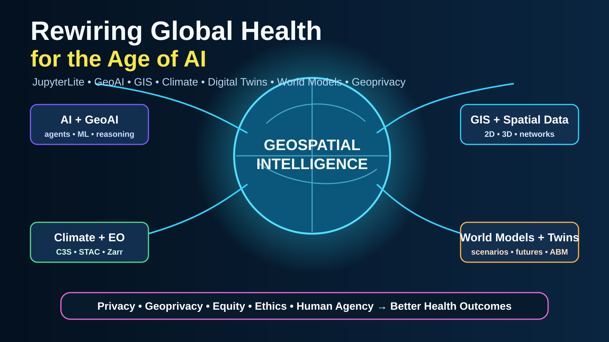

# Rewiring Global Health for the Age of AI



**Rewiring Global Health for the Age of AI** is a browser-first, open learning and prototyping environment for exploring how **AI, GeoAI, GIS, geospatial data science, Earth observation, climate data, digital twins, world models, and geospatial intelligence** can be combined to improve global-health decision-making—while protecting **privacy, geoprivacy, confidentiality, safety, equity, and human agency**.

This project extends a long-running “rewiring” idea: persistent public-health challenges require more than adding another tool to the existing stack. They invite us to redesign how evidence, people, models, maps, data systems, and decision processes connect. The 2013 Spatial Plexus presentation framed rewiring as a **provocation rather than a prescription**, and argued that any gains must exceed potential harms. This repository carries that framing into the AI era.

> **Core design principle:** maximize useful intelligence while minimizing unnecessary exposure of people, places, and sensitive health information.

## Live sites

GitHub Pages must be enabled with **Settings → Pages → Source: GitHub Actions** for these URLs to publish.

- **Jupyter Book:** https://jltobias.github.io/JupyterLite-Rewiring-Global-Health/
- **JupyterLite Lab:** https://jltobias.github.io/JupyterLite-Rewiring-Global-Health/lite/lab/index.html
- **Repository:** https://github.com/jltobias/JupyterLite-Rewiring-Global-Health

## Launch the labs

| Lab | Theme | Live notebook |
|---|---|---|
| 00 | Rewiring Global Health: framing, wicked problems, ethics | [Launch](https://jltobias.github.io/JupyterLite-Rewiring-Global-Health/lite/lab/index.html?path=00_rewiring_global_health.ipynb) |
| 01 | Climate + STAC + Copernicus C3S discovery | [Launch](https://jltobias.github.io/JupyterLite-Rewiring-Global-Health/lite/lab/index.html?path=01_climate_stac_c3s.ipynb) |
| 02 | Geospatial Intelligence: 2D maps, 3D surfaces, spatial reasoning | [Launch](https://jltobias.github.io/JupyterLite-Rewiring-Global-Health/lite/lab/index.html?path=02_geospatial_intelligence_2d_3d.ipynb) |
| 03 | GeoLibre browser GIS + 3D scene concepts | [Launch](https://jltobias.github.io/JupyterLite-Rewiring-Global-Health/lite/lab/index.html?path=03_geolibre_3d_scene.ipynb) |
| 04 | Animated health–climate time series | [Launch](https://jltobias.github.io/JupyterLite-Rewiring-Global-Health/lite/lab/index.html?path=04_animated_health_climate_timeseries.ipynb) |
| 05 | Zarr + SQL views + browser analytics | [Launch](https://jltobias.github.io/JupyterLite-Rewiring-Global-Health/lite/lab/index.html?path=05_zarr_sql_views.ipynb) |
| 06 | GeoAI + World Models + spatial grounding | [Launch](https://jltobias.github.io/JupyterLite-Rewiring-Global-Health/lite/lab/index.html?path=06_geoai_world_models.ipynb) |
| 07 | AI chats, agents, orchestration, privacy guardrails | [Launch](https://jltobias.github.io/JupyterLite-Rewiring-Global-Health/lite/lab/index.html?path=07_ai_orchestrator_privacy.ipynb) |
| 08 | Global-health digital twin / agent-based simulation pattern | [Launch](https://jltobias.github.io/JupyterLite-Rewiring-Global-Health/lite/lab/index.html?path=08_digital_twin_global_health.ipynb) |
| 09 | Geoprivacy + map encryption + do-no-harm workflow | [Launch](https://jltobias.github.io/JupyterLite-Rewiring-Global-Health/lite/lab/index.html?path=09_geoprivacy_map_encryption.ipynb) |

## What this repository is trying to rewire

The architecture deliberately connects domains that are often separated:

**Global Health + GIS + GeoAI + Climate + Earth Observation + Public Health Informatics + Digital Twins + Agent-Based Models + World Models + AI Agents + Privacy Engineering + Open Science**

The working hypothesis is that the next generation of geospatial intelligence will emerge from convergence rather than a single platform. A global-health analyst should be able to move from a question, to a map, to a climate or EO catalog, to an analytic model, to a simulation, to a scenario comparison, and to a documented decision trail—without requiring a large workstation or bespoke server for every learning exercise.

## Browser-first architecture

JupyterLite runs the notebook environment in the browser using WebAssembly-backed kernels. This reduces friction for workshops, demonstrations, and capacity building. The project uses browser-compatible patterns first and provides explicit handoffs for workloads that need full CPython, GPUs, protected data environments, or server-side secrets.

```text
Question / public-health decision
            |
            v
   Evidence + provenance
            |
            v
 Open geospatial + climate data
 STAC / COG / GeoJSON / Zarr
            |
            v
 JupyterLite in the browser
 Python + JS + maps + charts
            |
            +--> GeoLibre browser GIS
            +--> 2D / 3D / animation
            +--> GeoAI / ML prototypes
            +--> SQL / DuckDB-Wasm pattern
            +--> ABM / digital-twin pattern
            +--> AI / agent orchestration
            |
            v
 Privacy + geoprivacy + equity
 human review + uncertainty
            |
            v
 Better questions, decisions,
 interventions, and learning
```

## AI integration: safe by default

The notebooks include **deterministic teaching agents** and exportable prompt/request patterns rather than embedding API keys in a public static site. Live model calls should use an approved server-side proxy, short-lived credentials, or another authenticated service that keeps secrets out of notebooks and browser storage.

The project separates:

- **model reasoning** from **measurement**;
- **suggested operations** from **executed geospatial code**;
- **sensitive source data** from **shareable derived outputs**;
- **AI assistance** from **human accountability**.

A future deployment can integrate Jupyter AI or another chat interface where the runtime and credential model are appropriate. This repository does **not** assume that every JupyterLab AI extension is automatically compatible with JupyterLite.

## World Models and real-world geography

World models are especially relevant to global health when they are spatially grounded. A useful geospatial world model should represent not only imagery or geometry, but also:

- people, households, facilities, mobility, and social context;
- climate, environment, terrain, built form, and infrastructure;
- disease states, exposures, interventions, and health-system constraints;
- time, uncertainty, causality, and plausible counterfactual futures;
- privacy boundaries and permissions about what should **not** be represented at full precision.

The `06_geoai_world_models.ipynb` and `08_digital_twin_global_health.ipynb` labs treat world models and digital twins as **bounded decision-support models**, not literal replicas of reality.

## Privacy, geoprivacy, and do-no-harm

The 2013 rewiring deck already warned that privacy, confidentiality, security, cost, stewardship, metadata complexity, misuse, and negative consequences must be considered. That principle is stronger in the AI era.

This repository therefore uses these defaults:

1. Prefer public, synthetic, de-identified, aggregated, or generalized data for teaching.
2. Never publish patient-level operational data or secrets in notebooks.
3. Minimize precise coordinates when they are not necessary.
4. Treat rare events and unique geography as potentially identifying.
5. Document source, license, spatial resolution, time period, transformations, and uncertainty.
6. Separate data distribution from key or credential distribution.
7. Test whether AI/GeoAI outputs systematically disadvantage populations or places.
8. Keep a human review point before operational decisions.
9. Make assumptions visible.
10. Preserve the ability to say **do not automate**.

## Related projects

This repository connects and extends work from:

- Public Health Informatics Case Studies: https://github.com/PHI-Case-Studies
- JupyterLite + GeoLibre + GeoAI: https://github.com/jltobias/JupyterLite-GeoLibre-GeoAI
- JupyterLite GPT-6 Astra Geospatial: https://github.com/jltobias/JupyterLite-GPT-6-Astra-Geospatial
- Six Thinking Hats AI Agents + Orchestrator: https://github.com/jltobias/JupyterLite-AI-Agents-and-Orchestrator-Six-Thinking-Hats
- JupyterLite Global Health GIS: https://github.com/jltobias/JupyterLite-Global-Health-GIS
- JupyterLite zarr-sql views: https://github.com/jltobias/JupyterLite-zarr-sql-views
- JupyterLite World Monitor Prototype: https://github.com/jltobias/JupyterLite-World-Monitor-Prototype
- JupyterLite WorldView: https://github.com/jltobias/JupyterLite-WorldView

## Source presentations that shape this repository

- Tobias, J. L. (2013). *Rewiring to meet the challenges of “Wicked Problems” within global and domestic Public Health*. Spatial Plexus, November 6, 2013.
- Tobias, J. L. (2026). *JupyterLite: Geospatial Data Science and Global Health*. July 10, 2026.
- Tobias, J. L., Tolentino, H., Wuhib, T., Moonan, P., & Oeltmann, J. (2026). *Digital Twins: Botswana Kopanyo TB Study (2012–2016) for Gaborone TB simulation*. August 27, 2026.
- Tolentino, H., Tobias, J. L., Wuhib, T., & Mishra, V. (2026). *Map Encryption Democratized with JupyterLite*. September 21, 2026.
- Zuckerman, E. (2013). *Rewire: Digital Cosmopolitans in the Age of Connection*. W. W. Norton.

## Key software and standards

- JupyterLite: https://jupyterlite.readthedocs.io/
- Jupyter Book / MyST: https://jupyterbook.org/
- Pyodide: https://pyodide.org/
- GeoLibre: https://geolibre.app/
- GeoLibre source: https://github.com/opengeos/GeoLibre
- STAC: https://stacspec.org/
- Zarr: https://zarr.dev/ and https://zarr.readthedocs.io/
- DuckDB-Wasm: https://duckdb.org/docs/stable/clients/wasm/overview
- Copernicus Climate Data Store: https://cds.climate.copernicus.eu/
- Copernicus Interactive Climate Atlas: https://atlas.climate.copernicus.eu/

See **[DATA_SOURCES.md](DATA_SOURCES.md)** and **[THIRD_PARTY_NOTICES.md](THIRD_PARTY_NOTICES.md)** for detailed attribution.

## Build locally

```bash
python -m pip install -r requirements.txt
jupyter book build --html
jupyter lite build --contents notebooks --output-dir _build/html/lite
python -m http.server 8000 --directory _build/html
```

Then open:

- Book: http://localhost:8000/
- JupyterLite: http://localhost:8000/lite/lab/index.html

## License

- Original **code** in this repository: **MIT License** — see [LICENSE](LICENSE).
- Original **documentation and graphics**: **CC BY 4.0** — see [LICENSE-CONTENT.md](LICENSE-CONTENT.md).
- Third-party data, software, imagery, basemaps, publications, and embedded services retain their own terms. See [THIRD_PARTY_NOTICES.md](THIRD_PARTY_NOTICES.md).

## Disclaimer

This repository is for research, education, prototyping, and discussion. It is not medical advice, an operational surveillance system, or a substitute for applicable laws, policies, security controls, ethics review, scientific validation, or local public-health expertise. Views expressed in original narrative material are the authors' and do not necessarily represent the official position of any employer, agency, or government.
