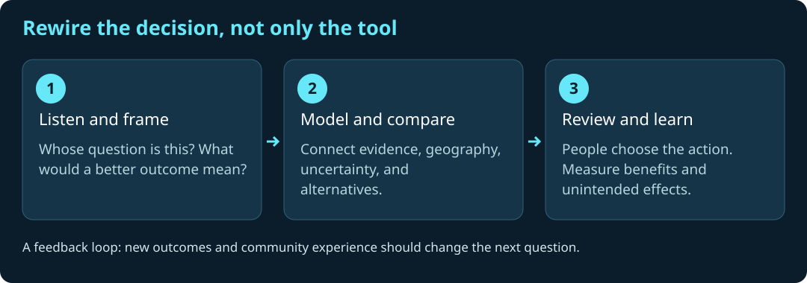

# Rewiring Global Health for the Age of AI


**A Jupyter Book, ten executable JupyterLite lessons, and an interactive geospatial lab.** Explore how AI, GIS, geospatial data science, GeoAI, world models, and digital twins can support better health decisions while preserving privacy, geoprivacy, equity, and human agency.

[](https://github.com/jltobias/JupyterLite-Rewiring-Global-Health/actions/workflows/pages.yml)

## Open the learning environment

- **[Read the Jupyter Book](https://jltobias.github.io/JupyterLite-Rewiring-Global-Health/)** — lessons, executed figures, interpretation, and teaching guidance.
- **[Launch JupyterLite](https://jltobias.github.io/JupyterLite-Rewiring-Global-Health/lite/lab/index.html)** — run and modify Python in your browser.
- **[Explore the interactive lab](https://jltobias.github.io/JupyterLite-Rewiring-Global-Health/demos/)** — linked 2D maps and time series, animation, small multiples, map matrices, space–time cubes, GeoJSON export, and an original video.
- **[Orbit the 3D scene](https://jltobias.github.io/JupyterLite-Rewiring-Global-Health/demos/scene.html)** — synthetic extruded geography, month controls, a flat view, and an accessible table.
- **[Open GeoLibre](https://web.geolibre.app/)** — import the [documented teaching layer](https://jltobias.github.io/JupyterLite-Rewiring-Global-Health/demos/data/heat-grid.geojson) using Lab 03.

GitHub Actions builds and publishes these project URLs. The badge reports deployment status. First-time runtime/package downloads need internet access; external videos, GeoLibre, and CDN-based 3D libraries have their own availability and terms.

## Choose a lesson

Each notebook includes a decision question, explained Python code, generated figures, interpretation, exercises, and citations. Run cells from top to bottom. The shared module and small data files ship with the notebooks.

| Lab | What you investigate | Run in JupyterLite |
|---|---|---|
| 00 · Rewiring global health | Stakeholder connections, policy weights, map sensitivity, and a decision record | [Launch](https://jltobias.github.io/JupyterLite-Rewiring-Global-Health/lite/lab/index.html?path=00_rewiring_global_health.ipynb) |
| 01 · Climate, C3S, and STAC | Real satellite catalog metadata, optional live discovery, synthetic climate anomalies, and provenance | [Launch](https://jltobias.github.io/JupyterLite-Rewiring-Global-Health/lite/lab/index.html?path=01_climate_stac_c3s.ipynb) |
| 02 · Geospatial intelligence | 2D maps, interactive Leaflet, orbitable 3D terrain, and population-weighted access sensitivity | [Launch](https://jltobias.github.io/JupyterLite-Rewiring-Global-Health/lite/lab/index.html?path=02_geospatial_intelligence_2d_3d.ipynb) |
| 03 · GeoLibre and 3D scenes | GeoJSON exchange, layer contracts, browser GIS, extrusion, and a creator-hosted video | [Launch](https://jltobias.github.io/JupyterLite-Rewiring-Global-Health/lite/lab/index.html?path=03_geolibre_3d_scene.ipynb) |
| 04 · Time and spatial patterns | Animated maps, six-panel comparisons, cell–time heatmaps, and a lag experiment | [Launch](https://jltobias.github.io/JupyterLite-Rewiring-Global-Health/lite/lab/index.html?path=04_animated_health_climate_timeseries.ipynb) |
| 05 · Zarr and SQL views | Chunked xarray/Zarr round trip, query costs, SQLite views, and a 3D space–time cube | [Launch](https://jltobias.github.io/JupyterLite-Rewiring-Global-Health/lite/lab/index.html?path=05_zarr_sql_views.ipynb) |
| 06 · GeoAI and world models | Fitted models, spatial holdouts, residual maps, distribution shift, and scenario ensembles | [Launch](https://jltobias.github.io/JupyterLite-Rewiring-Global-Health/lite/lab/index.html?path=06_geoai_world_models.ipynb) |
| 07 · AI chat and orchestration | Six perspectives, interactive teaching chat, JupyterLite AI setup, and an explicit gateway contract | [Launch](https://jltobias.github.io/JupyterLite-Rewiring-Global-Health/lite/lab/index.html?path=07_ai_orchestrator_privacy.ipynb) |
| 08 · Digital twins and spatial agents | Synchronous agent transitions, paired interventions, repeated seeds, and parameter uncertainty | [Launch](https://jltobias.github.io/JupyterLite-Rewiring-Global-Health/lite/lab/index.html?path=08_digital_twin_global_health.ipynb) |
| 09 · Geoprivacy and map encryption | Masking distortion, suppression, AES-GCM encryption, tamper rejection, and release review | [Launch](https://jltobias.github.io/JupyterLite-Rewiring-Global-Health/lite/lab/index.html?path=09_geoprivacy_map_encryption.ipynb) |

## Why rewire?

The starting point is James L. Tobias's 2013 Spatial Plexus presentation, *Rewiring to meet the challenges of “Wicked Problems” within global and domestic Public Health*. Its provocation was to reconsider connections among people, evidence, systems, and methods—and to require gains that justify potential harms. Ethan Zuckerman's *Rewire* places people, cross-cultural understanding, and bridge building at the center of a connected world. [Author's book page](https://ethanzuckerman.com/books/rewire/).

The AI-era opportunity is to connect geographic evidence with models that represent patterns, possible futures, service constraints, and uncertainty. That opportunity does not eliminate questions about who is represented, who benefits, who decides, and who can challenge an outcome.



The 2026 JupyterLite, Gaborone digital-twin, and map-encryption presentations extend this foundation into browser access, spatial simulation, and protected geospatial workflows. See the [source-to-lesson guide](book/source-presentations.md) and [full references](REFERENCES.md).

## What is real, synthetic, or optional?

| Component | Status and limits |
|---|---|
| Shared 64-cell, 24-month teaching grid | Entirely synthetic, seeded, geographically anchored near Gaborone. No actual households, facilities, disease events, vulnerability, or weather measurements. |
| STAC snapshot | Three actual Sentinel-2 catalog items from Element 84 Earth Search, retrieved 2026-10-04. Metadata only; source imagery is not bundled. |
| Climate exercises | Synthetic calculations plus an official C3S Atlas exploration workflow. No claim of a downloaded C3S dataset. |
| GeoAI and digital-twin outputs | Small, uncalibrated teaching models. Model correctness checks do not establish clinical validity or intervention effectiveness. |
| Zarr + SQL | A real local Zarr store and parameterized SQLite queries over a materialized subset. Larger DuckDB-Wasm workflows are linked as extensions. |
| AI chat | A working deterministic teaching widget; **jupyterlite-ai** is included for separately configured model providers. No live model service or credentials are supplied. |
| Encryption | Real AES-GCM on synthetic data with an ephemeral, unexported key. The exercise is not a managed key service or secure enclave. |

Use the least sensitive data and spatial precision that answer the question. Keep individual health information out of public notebooks, outputs, screenshots, URLs, and browser model contexts. Community participation and accountable human review are part of the method. [Privacy and ethics](PRIVACY_AND_ETHICS.md).

## AI, world models, and real geography

Lab 06 separates **prediction**, **assumed state transitions**, and **causal claims**. A learned world model may represent spatial and temporal dynamics, but it still needs grounding, constraints, validation, and an observation model. Lab 08 adds a small spatial agent simulation and compares uncertainty across seeds and parameters. These are inspectable starting points for research, not replicas of a city or validated TB forecasts.

Lab 07 uses de Bono's six perspectives and a project-specific purple synthesis step, inspired by the supplied global-health diagram. The template chat is explicitly labeled. For generative chat, open the included JupyterLite AI panel and configure an approved provider. Institutional deployments should use authenticated gateways, server-managed secrets, reviewed data flow, and bounded actions. [JupyterLite AI documentation](https://jupyterlite-ai.readthedocs.io/en/latest/).

## Sources, citations, and licenses

- **[REFERENCES.md](REFERENCES.md)** — books, four supplied presentations, scholarly foundations, and official technical documentation.
- **[DATA_SOURCES.md](DATA_SOURCES.md)** — bundled data/media assets, generators, status, units, retrieval dates, and attribution; separately lists optional external data ecosystems.
- **[THIRD_PARTY_NOTICES.md](THIRD_PARTY_NOTICES.md)** — software, video, conceptual influences, and third-party terms.
- **[CITATION.cff](CITATION.cff)** — machine-readable repository citation.
- Original code: **[MIT](LICENSE)**. Original narrative, generated figures, video, and synthetic data: **[CC BY 4.0](LICENSE-CONTENT.md)**. Third-party works retain their own terms.

Suggested citation: Tobias, James L. (2026). *Rewiring Global Health for the Age of AI*. GitHub repository. https://github.com/jltobias/JupyterLite-Rewiring-Global-Health. Cite the commit or release used and any underlying data products separately.

## Related work

- [Public Health Informatics Case Studies](https://github.com/PHI-Case-Studies) and [1854 cholera browser lesson](https://phi-case-studies.github.io/Jupyterlite-1854-Cholera-Basic/lab/index.html).
- [JupyterLite + GeoLibre + GeoAI](https://github.com/jltobias/JupyterLite-GeoLibre-GeoAI).
- [Zarr SQL teaching atlas](https://github.com/jltobias/JupyterLite-zarr-sql-views), inspired by [dzole0311/zarr-sql-views](https://github.com/dzole0311/zarr-sql-views).
- [AI Agents and Six Thinking Hats](https://github.com/jltobias/JupyterLite-AI-Agents-and-Orchestrator-Six-Thinking-Hats).
- [Gaborone TB storymap](https://github.com/jltobias/JupyterGIS-StoryMap-Gaborone-TB-ABM).
- [Global Health GIS](https://github.com/jltobias/JupyterLite-Global-Health-GIS), [WorldView](https://github.com/jltobias/JupyterLite-WorldView), and [World Monitor Prototype](https://github.com/jltobias/JupyterLite-World-Monitor-Prototype).

## Build and verify locally

Use Python 3.12+ and Node.js 22+. Activate a virtual environment first.

```bash
python -m pip install -r requirements-labs.txt
python scripts/check_models.py
python scripts/execute_notebooks.py
jupyter book build --html --strict
python scripts/prepare_site.py
jupyter lite build --contents _build/lite-contents --output-dir _build/html/lite
python -m http.server 8000 --directory _build/html
```

Open `http://localhost:8000/` for the book, `/demos/` for the explorer, and `/lite/lab/index.html` for JupyterLite. CI runs the same model/notebook checks before publishing. Notebook authoring source is in `scripts/build_notebooks.py`; run it after editing that source, then execute the changed notebooks. `scripts/build_assets.py` regenerates diagrams and demo data; `--video` also requires `imageio-ffmpeg`.

The [teaching guide](book/teaching-guide.md) explains browser downloads, local storage, accessibility, workshop sequencing, and troubleshooting. This project is for education and research; its teaching outputs are not medical advice or operational decision rules. Referenced organizations and projects do not imply endorsement.

See [VALIDATION.md](VALIDATION.md) for the native Python, browser runtime, interaction, and build checks performed for this update.
