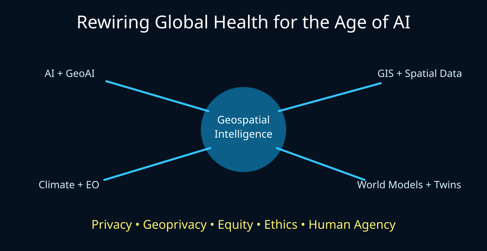

# Rewiring Global Health for the Age of AI

A browser-first Jupyter Book and JupyterLite series exploring the convergence of **AI, GeoAI, GIS, climate and Earth-observation data, digital twins, world models, privacy engineering, and global health**.

## Start here

Open **00 — Rewiring Global Health**, then choose a path:

- Climate + STAC → 01
- 2D/3D geospatial intelligence → 02–04
- Zarr + SQL → 05
- GeoAI + world models → 06
- AI agents and orchestration → 07
- Digital twins → 08
- Geoprivacy and map encryption → 09

The notebooks use synthetic or public examples by default. They are educational artifacts, not operational surveillance systems.