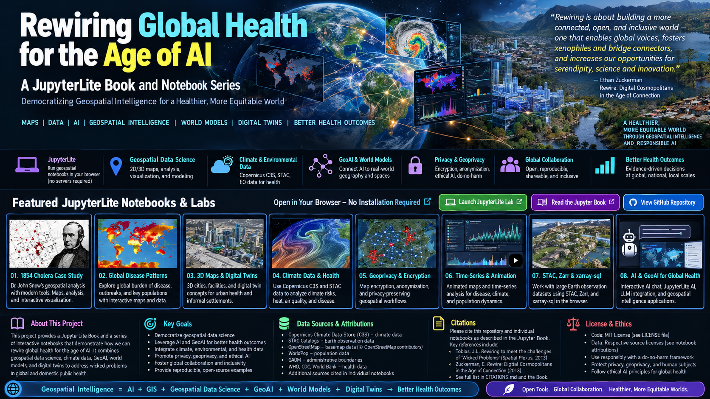

# Rewiring Global Health for the Age of AI

**Connect evidence, geography, models, and people—with privacy and human agency built into the work.**

This book joins ten executable lessons with an interactive lab. Read the executed figures here, explore the visual demos, then open JupyterLite to change the assumptions and rerun the analysis.

- [Run JupyterLite](https://jltobias.github.io/JupyterLite-Rewiring-Global-Health/lite/lab/index.html)
- [Explore linked maps, time series, and space–time cubes](https://jltobias.github.io/JupyterLite-Rewiring-Global-Health/demos/)
- [Orbit the 3D scene](https://jltobias.github.io/JupyterLite-Rewiring-Global-Health/demos/scene.html)

## Choose a route

| Your question | Lessons |
|---|---|
| What should we rewire, and who should decide? | [00: framing](../notebooks/00_rewiring_global_health.ipynb), [07: deliberation](../notebooks/07_ai_orchestrator_privacy.ipynb) |
| How do climate and spatial evidence become inspectable? | [01: discovery](../notebooks/01_climate_stac_c3s.ipynb), [02: 2D/3D](../notebooks/02_geospatial_intelligence_2d_3d.ipynb), [03: GeoLibre](../notebooks/03_geolibre_3d_scene.ipynb) |
| How do we reason about change? | [04: animation](../notebooks/04_animated_health_climate_timeseries.ipynb), [05: cubes and SQL](../notebooks/05_zarr_sql_views.ipynb) |
| What can models tell us? | [06: GeoAI and world models](../notebooks/06_geoai_world_models.ipynb), [08: spatial agents](../notebooks/08_digital_twin_global_health.ipynb) |
| How should geospatial information be protected? | [09: geoprivacy and encryption](../notebooks/09_geoprivacy_map_encryption.ipynb) |

## The evidence contract

The numerical teaching data are synthetic. Their coordinates place a fictional grid near Gaborone; the data do not describe actual people, facilities, disease, weather, or vulnerability there. The satellite catalog snapshot in Lab 01 is real metadata and is labeled separately. No protected study data are included.

The models illustrate methods, not validated clinical or policy conclusions. Each lesson names its assumptions, alternatives, limits, and sources. Use the [teaching guide](teaching-guide.md) for a workshop plan and [source presentations](source-presentations.md) to follow the intellectual lineage from 2013 to the AI era.
