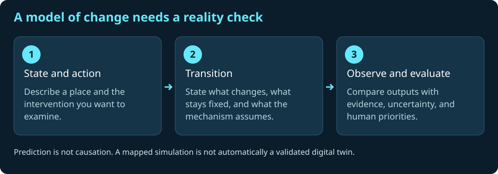

# World Models, Digital Twins, and Geography

A geospatial world model represents state and possible change in a real or synthetic place. For global health, it can connect environment, built form, mobility, health systems, populations, disease processes, and interventions.

A **digital twin** should not be described as an exact replica. It is a bounded model whose usefulness depends on data, mechanisms, calibration, uncertainty, and fitness for a specific decision.

The opportunity is to connect AI's ability to model complex environments with GIS's explicit representation of location, topology, scale, and spatial context. The risk is false precision: a visually rich twin can still be wrong, incomplete, inequitable, or unsafe.

## Four questions a world model must answer

| Question | Representation | Public-health example |
|---|---|---|
| What state are we representing? | Location, time, entities, relationships, uncertainty | Heat, mobility, service capacity, and population denominators |
| What changes under an action? | Transition model and constraints | A changed service schedule or reduced diagnostic delay |
| What do we observe? | Observation/measurement model | Partial notifications rather than complete disease prevalence |
| How do we evaluate a choice? | Outcomes, tradeoffs, and accountable review | Reach, access gaps, cost, privacy burden, and unintended effects |

Learned world-model research studies compact representations and predicted dynamics; see Ha and Schmidhuber's [World Models](https://worldmodels.github.io/). Geographic grounding adds scale, topology, spatial constraints, and relationships to real places. A language description or plausible generated scene alone does not establish those properties.

Lab 06 first fits a small predictive model and evaluates it in held-out geography. Its later state transition is explicitly hand-written. Lab 08 adds interacting synthetic agents and paired scenario runs. Neither is a trained foundation world model or a calibrated replica of Gaborone.

## A research agenda with inspectable milestones

Begin with a decision and governed evidence. Compare simple baselines before increasing model complexity. Separate uncertainty in parameters, stochastic realizations, measurements, and model structure. Test geographic and temporal transfer, including places underrepresented in the training evidence. Document the conditions under which an action could be interpreted causally.

For a living decision-support twin, define how observations update the model, who can change its assumptions, how drift is detected, and when use stops. Community members and local practitioners should be able to contest both inputs and outputs. More detailed geometry or a more capable model cannot substitute for those responsibilities.
